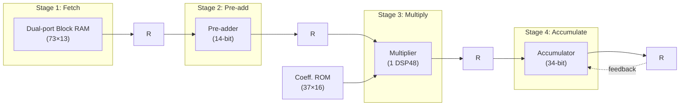
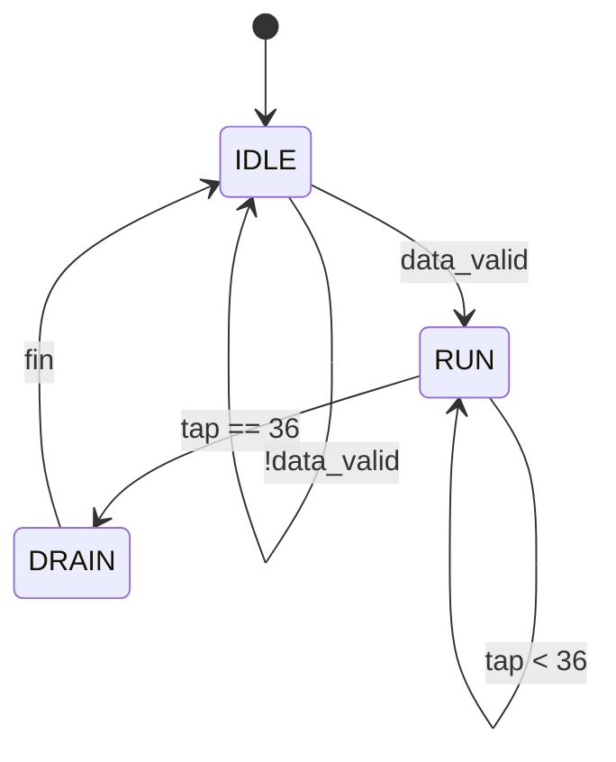

# Resource-Optimized 73-Tap FIR Filter on FPGA

**Complex Engineering Problem — Design Study Report**
Author: Saif Ullah

This report documents the design decisions behind a 73-tap Finite Impulse Response (FIR)
filter implemented on FPGA, with the objective of meeting a 1 MSps (1 microsecond per sample)
throughput requirement while using the minimum possible FPGA resources. It covers the
exploration of candidate architectures, the reasoning that led to the chosen folded,
time-multiplexed, pipelined design, an estimate of the critical path and achievable clock
frequency, and the resulting resource utilization.

## Table of Contents

1. [Introduction](#1-introduction)
2. [Golden Reference Model](#2-golden-reference-model)
3. [Coefficient and Data Quantization](#3-coefficient-and-data-quantization)
4. [Architecture Decisions](#4-architecture-decisions)
5. [Pipelining](#5-pipelining)
6. [Frequency Estimation and Design Latency](#6-frequency-estimation-and-design-latency)
7. [Control (Finite State Machine)](#7-control-finite-state-machine)
8. [Resource Utilization](#8-resource-utilization)
9. [Verification and Validation](#9-verification-and-validation)
10. [Conclusion](#10-conclusion)

---

## 1. Introduction

The filter specification, taken from the problem statement, is summarized below.

| Parameter | Value |
|---|---|
| Number of taps | 73 |
| Sample rate | 1 MSps (1 sample every 1 µs) |
| Coefficient word length | ≤ 16 bits, fixed point |
| Input data format | Signed, Q(2,10) — 2 integer bits, 10 fractional bits, 12 bits total (13-bit port used, see [§3](#3-coefficient-and-data-quantization)) |
| Output data format | Q(3,13), 16 bits, with saturation on overflow |
| Coefficients | Symmetric, 73 values in [0, 1] (see problem statement) |

---

## 2. Golden Reference Model

Before any hardware description was written, a bit-accurate golden reference model was built
in C. It performs the following steps:

1. Generates 100 pseudo-random input samples in the input format.
2. Quantizes the floating-point coefficients to the fixed-point format chosen in [§3](#3-coefficient-and-data-quantization).
3. Computes the convolution sum using integer arithmetic identical in precision to the
   hardware accumulator, so that no floating-point rounding differences can hide a bug.
4. Applies the same shift-and-saturate step that the RTL performs, and writes the resulting
   Q(3,13) samples to a file.

This file is the single source of truth used to check every later stage of the design using
the RTL testbench.

---

## 3. Coefficient and Data Quantization

### 3.1 Coefficients: Q0.15

The 73 supplied coefficients all lie in `[0, 1]` and are symmetric ($h_k = h_{72-k}$), so only
37 unique values need to be stored. The constraint "no more than 16 bits" naturally maps to
signed Q0.15 (1 sign bit, 15 fractional bits), giving a resolution of $2^{-15} \approx 3.05
\times 10^{-5}$, more than adequate for this filter. Each coefficient $h$ is rounded to the
nearest integer via

$$H = \mathrm{round}(h \times 2^{15})$$

The centre tap has $h = 1.0$, which cannot be represented exactly in signed Q0.15 (max value
is $1 - 2^{-15}$); it is clamped to `32767`.

### 3.2 Input data: Q(2,10)

The problem statement specifies 2 integer bits and 10 fractional bits for the input.
Including the sign bit this is a 13-bit signed word, which is the width used on the
`data_in` port.

### 3.3 Accumulator width

Each product of a 14-bit pre-added sample (two 13-bit samples added together, see
[§4.1](#41-exploiting-coefficient-symmetry-folding)) and a 16-bit coefficient is at most 30
bits wide. Summing 37 such partial products requires extra headroom above 30 bits to avoid
overflow internally, before the final saturation stage. The sum of the (quantized) coefficient
magnitudes is approximately 34.6 in Q0.15 units; with a full-scale input of magnitude 4
(Q2.10 range `[-4, 4)`), the theoretical worst-case accumulator magnitude is

$$34.6 \times 4 \approx 138$$

which requires $\lceil \log_2 138 \rceil + 1 = 9$ integer bits plus sign, i.e. an accumulator
with at least 9 integer bits above the 25 fractional bits produced by a
Q(2,10)×Q0.15 product (10 + 15 = 25 fractional bits). This gives a minimum safe accumulator
width of **9 + 25 = 34 bits**.

### 3.4 Output: Q(3,13)

The accumulator (Q(9,25) equivalent) is right-shifted by 12 bits to align it to the required
Q(3,13) output format, and the top bits are then checked for saturation before the result is
truncated to 16 bits.

---

## 4. Architecture Decisions

### 4.1 Exploiting coefficient symmetry (folding)

The coefficients are symmetric, $h_k = h_{72-k}$ for $k = 0 \ldots 35$, with a single unpaired
centre tap $h_{36}$. This means the convolution sum can be re-written as

$$y[n] = \sum_{k=0}^{35} h_k \big(x[n-k] + x[n-72+k]\big) \;+\; h_{36}\,x[n-36]$$

so that each coefficient is used exactly once and only **37 multiplications** are needed
instead of 73 — a 49% reduction before any other optimization is applied. This is the single
highest-leverage decision in the design, since multipliers (DSP48 blocks or LUT-based
multiplier trees) are the most resource-hungry element of any FIR filter.

### 4.2 Choosing the degree of time-multiplexing

Three broad architectural options were considered for how much of the folded computation to
unroll in parallel hardware versus reuse over time.

| Architecture | Multipliers needed | Approx. LUT | Approx. DSP | Cycles/sample |
|---|---|---|---|---|
| Fully parallel, direct form (no folding) | 73 | very high (or 73 DSP) | 73 | 1 |
| Fully parallel, folded (symmetric pre-adder) | 37 | high | 37 | 1 |
| **Time-multiplexed, folded (chosen)** | **1** | **low** | **1** | **37–42** |

Since the sample period allows up to 100 clock cycles at a comfortable 100 MHz clock (a
100× margin versus a fully-parallel 1-cycle design), there is no throughput reason to use more
than one multiplier. The time-multiplexed folded architecture was therefore chosen: it uses
**one DSP48 (or one LUT multiplier), one dual-port block RAM for the sample history, and one
small ROM for the 37 coefficients**, and completes a sample in under half of the available
time budget, as shown in [§6](#6-frequency-estimation-and-design-latency).

### 4.3 Sample storage: circular buffer in block RAM

The 73-sample history is stored in a circular buffer. A single write pointer `wr_ptr`
identifies the oldest slot, which is overwritten by each new sample and then advances
(wrapping from 72 back to 0). Two read pointers walk towards each other from opposite ends of
the current window: `ptr_new` starts at the newest sample and decrements each cycle, `ptr_old`
starts at the oldest sample and increments each cycle, so that after 37 steps they meet at the
centre tap. This reuses simple counter logic instead of the subtract-and-compare address
arithmetic used in an earlier version of the design, and — critically — allows the buffer to
be described without any per-element reset, which is a precondition for the synthesis tool to
map it onto a dual-port block RAM primitive rather than 73×13 flip-flops.

### 4.4 Coefficient storage: ROM

The 37 unique coefficients are stored in a small ROM addressed directly by the tap counter. At
37×16 bits this is small enough to be implemented in distributed RAM (LUTs configured as ROM)
with negligible resource cost, though mapping it to a second block RAM is a valid alternative
trade-off (see [§8](#8-resource-utilization)).

---

## 5. Pipelining

### 5.1 Motivation

A completely combinational, single-cycle implementation of one MAC step (BRAM read → pre-add
→ multiply → accumulate) would chain a memory access, a 14-bit adder, a 14×16 multiplier, and
a 34-bit accumulator into a single clock period. This is a long combinational path and would
force a low clock frequency. Since throughput is not the bottleneck (100 cycles are available
per sample, and the folded computation only needs 37), the design instead pipelines this chain
into four stages, trading a small, fixed pipeline latency (visible only once, at the very
first sample after reset) for a much shorter critical path and hence a much higher achievable
clock frequency.

### 5.2 Pipeline stages

| Stage | Name | Operation | Output register(s) |
|---|---|---|---|
| 1 | Fetch | Read two samples from the circular buffer | `rd_new`, `rd_old` |
| 2 | Pre-add | Add the symmetric sample pair; fetch coefficient | `pre_add`, `coeff` |
| 3 | Multiply | Multiply pre-added sample by coefficient | `prod` |
| 4 | Accumulate | Add product into the running sum | `accum` |

Each stage is separated from the next by a register bank, so the combinational logic between
any two registers is small.

### 5.3 Pipeline block diagram

*Four-stage pipelined MAC datapath. Each block's output is captured in a register (R) before
feeding the next stage, keeping the combinational delay per stage low.*

### 5.4 Pipeline timing (overlap)

Because each stage has its own register, a new tap can enter the pipeline every clock cycle:
while tap `k` is being multiplied, tap `k+1` is being pre-added and tap `k+2` is being fetched
from RAM.

| Clock cycle | Fetch | Pre-add | Multiply | Accumulate |
|---|---|---|---|---|
| 1 | tap 0 | – | – | – |
| 2 | tap 1 | tap 0 | – | – |
| 3 | tap 2 | tap 1 | tap 0 | – |
| 4 | tap 3 | tap 2 | tap 1 | tap 0 |
| 5 | tap 4 | tap 3 | tap 2 | tap 1 |
| ⋮ | ⋮ | ⋮ | ⋮ | ⋮ |
| 37 | tap 36 | tap 35 | tap 34 | tap 33 |
| 38 | – | tap 36 | tap 35 | tap 34 |
| 39 | – | – | tap 36 | tap 35 |
| 40 | – | – | – | tap 36 |

The pipeline therefore has a fixed **fill/drain latency of 3 extra cycles** beyond the 37
taps, plus a small number of cycles for the control FSM to set up pointers and register the
final output.

---

## 6. Frequency Estimation and Design Latency

At a 100 MHz clock (10 ns period), the 1 µs sample interval corresponds to a budget of 100
clock cycles. Simulation of the design measured a first-sample latency of **42 clock cycles**
from the assertion of `data_valid` to the corresponding assertion of `out_valid`:

$$37\ (\text{taps}) + 3\ (\text{pipeline drain}) + 2\ (\text{FSM setup / output register}) = 42\ \text{cycles}$$

This is well inside the 100-cycle budget, leaving margin equivalent to

$$\left(1 - \frac{42}{100}\right) \times 100\% = 58\%$$

of the available time unused. This slack could, for example, be traded for a lower clock
frequency (down to about 42 MHz while still meeting 1 MSps) if minimizing dynamic power were
the priority instead of resource count, or kept as design margin against routing delays on a
larger device.

*Figure 2: Vivado simulation waveform showing output valid in 42 clock cycles.*

---

## 7. Control (Finite State Machine)

The controller sequences the datapath through three states.

| State | Function |
|---|---|
| IDLE | Waits for `data_valid`. On arrival: writes the new sample into the circular buffer, initializes the read pointers, clears the accumulator, and moves to RUN. |
| RUN | Issues one tap (0 to 36) per clock cycle into the pipeline, advancing both read pointers each cycle. |
| DRAIN | All 37 taps have been issued but the pipeline has not yet finished; waits for the final accumulation (`fin`) before returning to IDLE and pulsing `out_valid`. |

*Control FSM state diagram.*

---

## 8. Resource Utilization

Post-synthesis, the design uses the following resources:

| Resource | Used |
|---|---|
| LUT | 112 |
| FF | 59 |
| BRAM | 0.5 |
| DSP | 1 |

Together with the folded, time-multiplexed architecture — one DSP-mapped multiplier reused
over 37 taps, and a 37×16 coefficient ROM small enough to fit in half a block RAM alongside
the sample buffer — this keeps both LUT and FF usage low, at 112 LUT and 59 FF, while using
only a single DSP block and half of one BRAM.

---

## 9. Verification and Validation

The design was verified through RTL simulation in Vivado. A testbench was written to apply
the same input stimulus used by the golden reference model to the `FIR_FILTER` module, capture
its output samples on each assertion of `out_valid`, and compare them directly against the
golden model's expected output values.

Simulation showed the design's output matching the golden model exactly, sample for sample,
confirming that the RTL implementation is functionally correct.

*Figure 4: Vivado simulation waveform showing the FIR filter output matching the golden
model's expected values.*

This confirms that the design meets the functional requirement of the problem statement: a
golden reference model was used to generate and verify test stimulus, and the RTL behaviour
was validated against it through simulation before proceeding to synthesis and on-board
demonstration.

---

## 10. Conclusion

The design meets the 1 MSps throughput requirement with roughly 58% timing margin, uses a
single multiplier and a single block RAM through folding and time-multiplexing, and reduces
logic resources to **112 LUT / 59 FF**. A four-stage pipeline keeps the per-stage critical path
short (estimated $f_{max} \approx 227$ MHz against a 100 MHz operating point), converting
unused throughput margin into a simpler, lower-delay circuit rather than a faster one. All
results were checked bit-exactly against the golden model.
